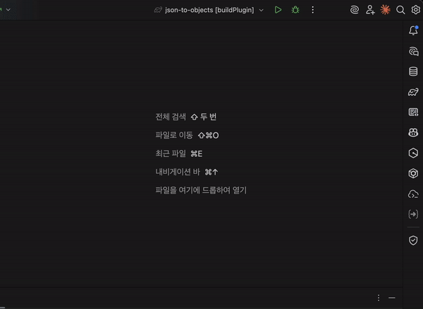
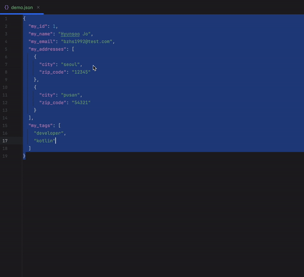
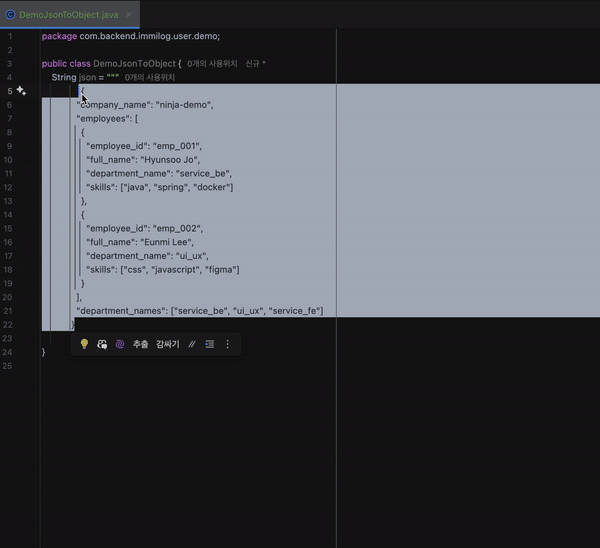
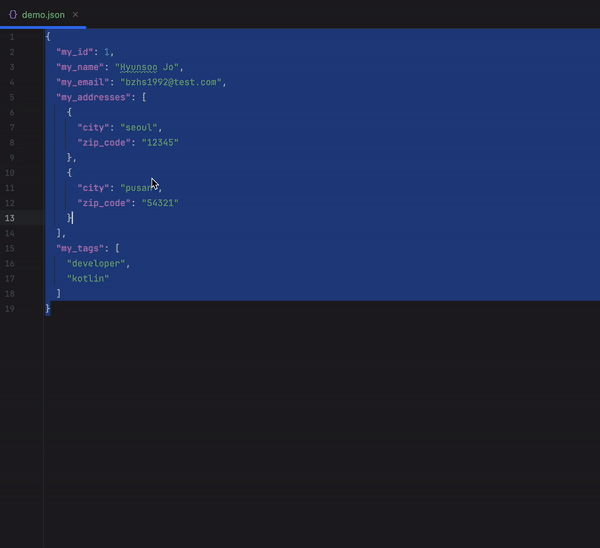

# JSON to Java/Kotlin Object

IntelliJ IDEA plugin that converts JSON to Java/Kotlin classes.

## Demo

### Java




### Kotlin


## Features

- Generate **Java classes** or **Kotlin data classes** from JSON
- **Lombok support**: @Data, @Getter, @Setter, @NoArgsConstructor, @AllArgsConstructor
- **Java Record** support (Java 14+)
- **@JsonProperty** annotation support
- Multiple structure options: Inner class, Separate classes, Multiple files
- JSON validation with helpful error messages
- **Auto package detection**: Automatically detects package from open Kotlin/Java files

## Usage

### 1. Right-click on JSON file
Right-click on any `.json` file → **JSON to Java/Kotlin Object**

### 2. Select text in editor
Select JSON text in any file → Right-click → **JSON to Java/Kotlin Object**

### 3. Tools menu
**Tools** → **JSON to Java/Kotlin Object**

### 4. Shortcut
`Ctrl+Alt+Shift+J`

## Installation

### From JetBrains Marketplace
1. Open **Settings** → **Plugins** → **Marketplace**
2. Search for "JSON to Java/Kotlin Object"
3. Click **Install**

### Manual Installation
1. Download the latest release from [Releases](https://github.com/user/json-to-objects/releases)
2. Open **Settings** → **Plugins** → **⚙️** → **Install Plugin from Disk...**
3. Select the downloaded `.zip` file

## Build

```bash
./gradlew build
```

## Run (Development)

```bash
./gradlew runIde
```

## License

MIT License

## Harness

이 저장소는 ninja-harness를 사용한다. 설정 가능한 `HARNESS_*` 환경변수는 `docs/harness/CONFIGURATION.md`를 기준으로 확인한다.

### Makefile 명령

| 명령 | 설명 |
|---|---|
| `make doctor` | 로컬 하네스 도구와 스크립트 실행 가능 여부를 확인한다. |
| `make verify` | template/project 하네스 구조 검증을 실행한다. |
| `make verify-template` | template mode 구조 검증을 실행한다. |
| `make verify-project` | project mode 구조 검증을 실행한다. |
| `make project-ready` | project mode에서 profile/context placeholder가 남아 있으면 실패한다. |
| `make check-profile` | project profile/context placeholder만 점검한다. |
| `make self-test-gates` | 하네스 gate self-test를 실행한다. |
| `make unit-tests` | 하네스 Python unit test를 실행한다. |
| `make check-active-plans` | 완료되지 않은 active plan 잔여 여부를 확인한다. |
| `make integrity` | doctor, verify, self-test, unit test, plan check, diff check를 묶어 실행한다. |
| `make verify-org` | 조직 표준 모드 검증을 실행한다. 실제 `HARNESS_*_SCRIPT` gate가 필요하다. |
| `make project-gates` | 설정된 project gate를 실행한다. |
| `make project-gates-required` | project gate가 없으면 실패한다. |
| `make sync-skills` | `.agents/skills`를 `.claude/skills`로 동기화한다. |
| `make check-sync` | skill mirror 동기화 후 구조 검증을 실행한다. |
| `make eval` | completed plan 기반 eval metrics를 수집한다. |
| `make check-plans` | completed plan 품질을 점검한다. |
| `make set-model` | `MODEL=<model>`로 Codex agent model 값을 갱신한다. |
| `make harness-upgrade` | 하네스 버전과 업그레이드 메타데이터를 점검한다. |
| `make apply-harness` | `TARGET=<repo>`로 다른 저장소 적용 dry-run을 실행한다. |
| `make clean` | 로컬 생성 메타데이터와 런타임 캐시 파일을 제거한다. |

### 배포 전 체크리스트

```bash
make doctor
make verify
make check-sync
make harness-upgrade
make integrity
make eval
```

조직 표준 검증에는 실제 repository script gate를 연결한다.

```bash
HARNESS_INTEGRATION_TEST_SCRIPT='scripts/ci/integration-test.sh' make verify-org
```

Project gate는 `HARNESS_*_SCRIPT`로 repository 내부 allowlist 경로의 실제 script 파일을 지정하는 방식을 우선한다. Gate script 파일과 경로 구성 요소는 symlink이면 안 되며, symlink로 repository 밖 스크립트를 가리키는 구성은 거부한다. Windows PowerShell gate는 lower-level runner가 `-NoProfile -NonInteractive`로 deterministic invocation을 수행한다. Legacy `HARNESS_*_CMD`는 신뢰된 CI에서 명시 승인된 경우에만 사용한다.

### 배포 제외 파일

다음 파일과 패턴은 배포 산출물에 포함하지 않는다.

```txt
docs/harness/plans/active/*.md
docs/harness/plans/completed/*.md
.env*
*.pem
*.p12
*.key
*.keystore
*secret*.json
*secret*.yml
*secret*.yaml
*secret*.txt
*secret*.conf
*secret*.config
*secret*.ini
*secret*.properties
*secret*.toml
*token*.json
*token*.yml
*token*.yaml
*token*.txt
*token*.conf
*token*.config
*token*.ini
*token*.properties
*token*.toml
```

`token-policy.md`처럼 정책을 설명하는 문서 파일명은 허용하지만, secret/token 이름을 가진 로컬 설정성 산출물은 배포 전에 제거한다.
